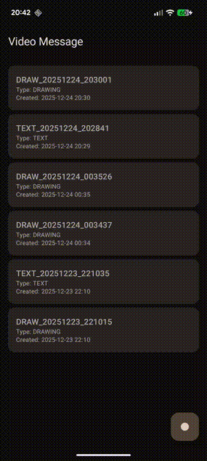

# Video Message - User Input Video Generation PoC

**Video Message** is a native Android application that serves as a **Proof of Concept (PoC)** demonstrating how to generate video files (`.mp4`) programmatically based on user interactions—specifically text input and drawing gestures—rather than capturing a traditional camera feed.

Unlike standard screen recorders that capture the entire display buffer, this project utilizes a custom rendering engine that translates Jetpack Compose state changes into a video stream in real-time, allowing for high-quality, resolution-independent video generation.



## 🎯 Concept & Motivation

The primary goal of this project is to explore the creation of "digital context" videos.
*   **Source of Truth:** The video content is derived strictly from user input (typing, scrolling, cursor movement, drawing strokes).
*   **Technical Challenge:** Synchronizing the reactive UI state of **Jetpack Compose** with the imperative, low-level **Android Graphics Canvas** API to produce bitmaps that are fed into a `MediaRecorder` surface via background Coroutines.

## ✨ Features

### 1. Text-to-Video Creation
*   **Real-time Recording:** Records the exact typing process, including cursor movements and text selection.
*   **Smart Scrolling:** Automatically handles vertical scrolling within the video frame to ensure the active text line is always visible.
*   **Rich Styling:**
    *   Dynamic Font Sizing.
    *   Text Styles (Bold, Italic, Normal).
    *   Text Color and Background Color customization.
*   **Resolution Scaling:** Renders text on a virtual canvas matching the view dimensions and scales it proportionally (Aspect Fit) to the target video resolution (960x1280).

### 2. Drawing-to-Video Creation
*   **Canvas Recording:** Captures touch drag gestures to render smooth paths.
*   **Latency-Free Drawing:** Implements a dual-layer rendering strategy:
    *   **UI Layer:** Renders the active path immediately on the Compose Canvas for zero-latency user feedback.
    *   **Recorder Layer:** Asynchronously processes the path data on a background thread to generate video frames.
*   **Tools:** Customizable brush thickness, brush color, and canvas background color.

### 3. Gallery & Playback
*   **Persisted Gallery:** Displays a list of generated videos stored in the app-specific internal storage, sorted by creation date.
*   **Integrated Player:** Built-in video player using **Media3 (ExoPlayer)**.
*   **File Management:** Ability to share videos via system intent or delete them from both the database and file system.

## 🛠 Tech Stack

*   **Language:** [Kotlin](https://kotlinlang.org/) (100%)
*   **UI Toolkit:** [Jetpack Compose](https://developer.android.com/jetpack/compose) (Material 3)
*   **Architecture:** MVVM (Model-View-ViewModel) with Clean Architecture principles.
*   **Dependency Injection:** [Hilt](https://dagger.dev/hilt/)
*   **Asynchronous Programming:** Kotlin Coroutines & Flow.
*   **Local Storage:**
    *   **Room Database:** For persisting video metadata.
    *   **Internal File Storage:** For storing `.mp4` files.
*   **Media & Graphics:**
    *   **Media3 (ExoPlayer):** For video playback.
    *   **Android MediaRecorder:** For encoding video streams (H.264).
    *   **Android Graphics (Canvas/Paint/Bitmap):** For off-screen frame generation.
*   **Build System:** Gradle Kotlin DSL with Version Catalogs (`libs.versions.toml`).

## 🏗 Architecture & Design

The application follows a unidirectional data flow pattern and separates concerns into distinct layers:

### 1. Recorder Engine (`recorder` package)
This is the core of the PoC.
*   **`VideoRecorderImpl`:** Manages the `MediaRecorder` lifecycle and the Input Surface. It runs a loop on a background coroutine to ensure a consistent frame rate (e.g., 20 FPS).
*   **`FrameProducer` (Strategy Pattern):**
    *   **`TextFrameProducer`:** Converts `TextFrameData` (text, styles, scroll position) into a `Bitmap` using Android's `StaticLayout`.
    *   **`DrawingFrameProducer`:** Converts `DrawingFrameData` (paths, colors) into a `Bitmap` using `android.graphics.Canvas`.
    *   Both producers handle **Aspect Fit scaling** to ensure the content created on a device screen fits perfectly into the fixed video resolution.

### 2. UI Layer (`ui` package)
*   **Composables:** Pure functions representing the UI state.
*   **ViewModels:** Manage `StateFlow` for UI state and handle interaction logic. They decouple the UI from the heavy lifting of frame generation.
    *   *Optimization:* The Drawing screen uses local state for the immediate drawing path to ensure 60fps UI performance, while asynchronously updating the recorder state.

### 3. Data Layer (`data` & `domain` packages)
*   **`VideoRepository`:** Acts as a single source of truth, coordinating between the `VideoDao` (Database) and the File System.
*   **Room:** Stores structured data (`VideoEntity`) linking file paths to display names and timestamps.

## 🚀 Getting Started

1.  **Clone the repository:**
    ```bash
    git clone https://github.com/your-username/VideoMessage.git
    ```
2.  **Open in Android Studio:** Ensure you are using the latest stable version (Ladybug or newer recommended).
3.  **Sync Gradle:** The project uses KSP and Version Catalogs. Wait for the sync to complete.
4.  **Build & Run:** Deploy to an emulator or physical device (Min SDK 28).

## 🔮 Future Improvements

*   **Audio Recording:** Add microphone support to record voiceovers while typing or drawing.
*   **Video Export Settings:** Allow users to choose resolution and FPS before recording.
*   **Undo/Redo:** Implement command pattern for drawing actions.
*   **Complex Text Layouts:** Support for rich text editing (different styles within the same paragraph).

## 📄 License

This project is licensed under the MIT License - see the [LICENSE](LICENSE) file for details.
